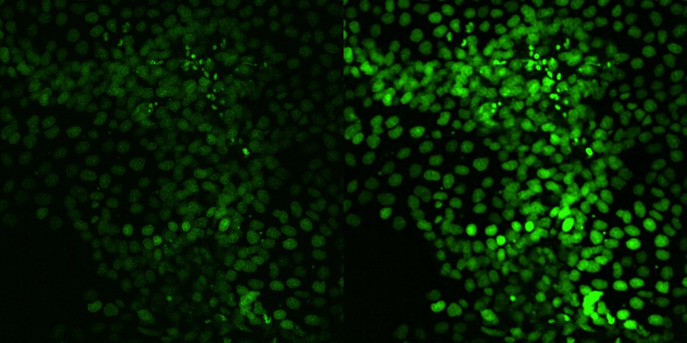
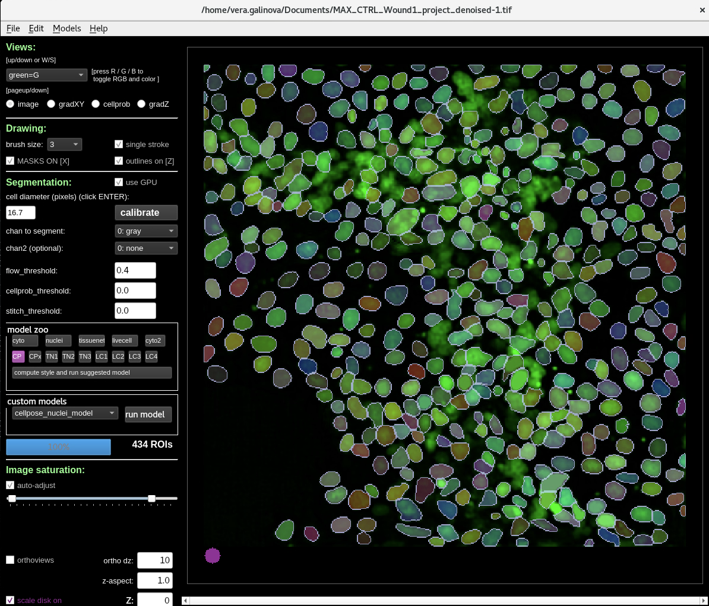
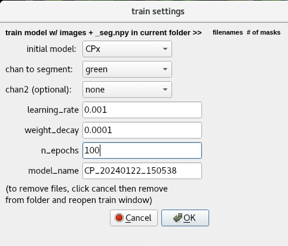
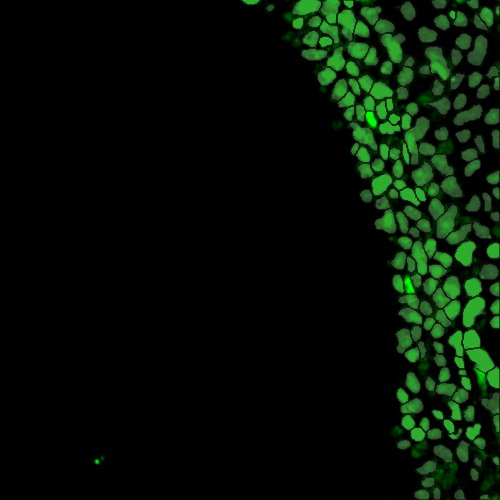
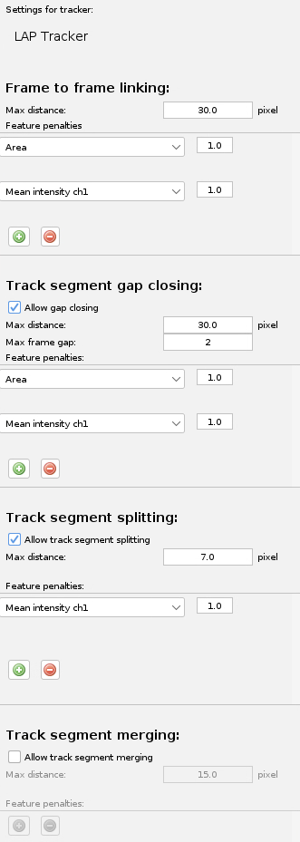
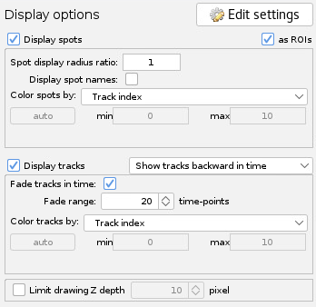

  

# Project #11: Segmentation and tracking of epithelial cells

---
If any of the instructions are not working, please open an issue or contact us at [ai4life@fht.org](ai4life@fht.org)! 

## Table of Contents
1. [Introduction](#introduction)
2. [Installation](#installation)
3. [Denoising with N2V](#step-1-denoising-with-n2v)
4. [Segmentation with Cellpose](#step-2-segmentation-with-cellpose)
6. [Tracking with Trackmate-Cellpose](#step-3-tracking-with-trackmate-cellpose-in-fiji)
7. [Conclusion](#conclusion)


## Introduction
In this tutorial, we'll show how to segment and track individual epithelial cells in a series of images obtained with fluorescence microscopy.   

We will start by denoising the images using [N2V](https://github.com/juglab/n2v) Python package, which helps to denoise microscopy images using deep learning. Next, we will segment cells using [Cellpose](https://www.cellpose.org/), a popular deep-learning cell segmentation algorithm. Finally, we'll track the segmented cells using the TrackMate plugin in Fiji.

Here is an example of the original data and resulting tracking: 
<div> 
  
</div>

Let's get started! 

## Installation

### Install Python package manager
We recommend installing [conda](https://conda.io/projects/conda/en/latest/user-guide/install/index.html) or [mamba](https://mamba.readthedocs.io/en/latest/). Go to the website and follow the installation instructions for your operating system.  
During installation, select the installation folder that you have permissions for, like your home folder.

### Install N2V
Follow [N2V installation](https://github.com/juglab/n2v) for official instruction.
<details>
<summary>N2V installation details</summary>

1. Open terminal (like PowerShell on Windows or Terminal on MacOS)
2. Create and activate a new conda environment:
    ```bash
    conda create -n n2v python=3.9 
    conda activate n2v
     ```
3. Install Tensorflow by following the [official instruction](https://www.tensorflow.org/install/pip#linux_1). If you have no GPU availiable, install the CPU version.  
N2V only supports Tensorflow 2. We'll now install version 2.13.0 with GPU support as an example:
   ```bash 
   pip install tensorflow[and-cuda]==2.13.0
   ```
4. Check if the installation is correct. If you are using GPU, this command should return a list of availiable devices:
    ```bash
    python -c "import tensorflow as tf; print(tf.config.list_physical_devices('GPU'))"
    ```
5. Install N2V and Jupyter:
   ```bash 
   pip install n2v jupyter
   ```
</details>

### Install Cellpose
Follow [Cellpose installation](https://github.com/MouseLand/cellpose) for official instruction.  
If you are using GPU check out [GPU version (CUDA) on Windows or Linux](https://github.com/MouseLand/cellpose?tab=readme-ov-file#gpu-version-cuda-on-windows-or-linux) section.

<details>
<summary>Cellpose installation details</summary>

1. We recommend creating a new separate environment:
   ```bash
   conda create -n cellpose python=3.9
   conda activate cellpose
   ``` 
2. Install PyTorch by following the [official instruction](https://pytorch.org/).  
If you have a GPU, select a version that is compatible with your driver version. Follow [this link](https://pytorch.org/get-started/previous-versions/) for older versions.  
We will be installing PyTorch version 1.12 and cudatoolkit version 11.3 as an example:
   ```bash 
   conda install pytorch==1.12.0 torchvision==0.13.0 cudatoolkit=11.3 -c pytorch
   ``` 
3. Check if the installation is correct. If you are using GPU, this command should return a list of availiable devices:
   ```bash
   python -c "import torch; print([torch.cuda.get_device_properties(i) for i in range(torch.cuda.device_count())])"`
   ```
4. Install Cellpose:
   ```bash 
   pip install pyqt5 "cellpose[gui]"
   ```
5. Check the installation by running Cellpose. You should see the Cellpose window open:
   ```bash
   cellpose
   ```
</details>

### Install TrackMate-Cellpose
Follow  [TrackMate-Cellpose](https://imagej.net/plugins/trackmate/detectors/trackmate-cellpose) for official instruction.
<details>
<summary>TrackMate-Cellpose installation details</summary>

1. Open Fiji.
2. Add The **TrackMate-Cellpose** update site and restart Fiji.
3. In your **cellpose** conda environment, run this command to find where your python is installed:
   ```bash
   which python
   ```
4. Open TrackMate and select **Cellpose detector** from the list of availiable detectors.
5. Insert the path to your python in Path to Cellpose 
</details>

## Step #1: Denoising with N2V
If the images are noisy, denoising can help achive better segmentation performance. Most deep learning segmentation models are trained with clean images, so noise in the data severely affects the resulting accuracy.  

You will likely need to re-train the denoising model for different experiments, because differences in noise distribution will affect the performance.

N2V offers a [Python package](https://github.com/juglab/n2v), a [Napari plugin](https://github.com/juglab/napari-n2v), of, if you do not have a GPU available, you can try using a Google Colab N2V notebook from [ZeroCostDL4Mic](https://github.com/HenriquesLab/ZeroCostDL4Mic).  

### Usage:
1. Download the example jupyter notebook here: [N2V_denoising.ipynb](resources/N2V_denoising.ipynb)
2. Download example time-series here: [MAX_CTRL_Wound1_cropped_scaled.tif](resources/example_data/MAX_CTRL_Wound1_project.tif)
3. Activate the conda environment
    ```bash
    conda activate n2v
     ```
4. Run jupyter service
    ```bash 
    jupyter notebook
    ```
5. In the opened browser page, open the notebook and follow the instructions.
6. To run a pre-trained model, download and unzip the [pretrained model](resources/models/n2v_2D.zip). Then, in the Jupyter Notebook, go to the section *7. Prediction*.

Here is an example of original and denoised image:
<div> 
  
</div>


## Step #2: Segmentation with Cellpose
### Usage
[Cellpose](https://github.com/MouseLand/cellpose) is a popular deep learning cell segmentation algorythm. 
1. Download example denoised image here: [MAX_CTRL_Wound1_project_denoised-1.tif](resources/example_data/MAX_CTRL_Wound1_project_denoised-1.tif)
2. Download and unzip pre-trained models for membrane and nuclei segmentation: [cellpose_membrane_model.zip](resources/models/cellpose_membrane_model.zip)
3. Activate the conda environment
   ```bash
   conda activate cellpose
   ```
4. Run Cellpose
   ```bash
   cellpose
   ```
5. Select the channels you want to segment. If you want to segment entire cells, add the membranes as `chan to segment` and nuclei as `chan2`. If you want to segment only nuclei, and them to `chan to segment` and leave `chan2` empty. 
6. Calibrate the average object size automatically by clicking `callibrate`. The circle on the bottom-left should be approximately the size of the objects you want to segment.
7. Check how default models perform on the data by clicking any in the `model zoo` section.
8. Add a custom pretrained model to the interface: ``Models > Add custom torch model to GUI``.
9. Select this model in `custom models` section and run it by clicking `run model`

<div> 
  
</div>


### How to train your own model

You can watch a video tutorial on how to use Cellpose here - [https://www.cellpose.org/](https://www.cellpose.org/) 

1. Find the best working model from the `model zoo` section.
2. Look through the errors in the predictions and correct a few of them. `Click Help` > `Help with GUI` for help with labeling controls.
3. Train a new model on the corrected data. Click `Models` > `Train new model`
4. Choose the best model from step 3 as an initial model. You cannot select a custom model as an initial model.
5. We suggest using the following settings: 
   <div> 
     
   </div>
   
6. After training, you’ll see your new model in the `custom models` section. It will also be saved in the folder with your data. `Cell diameter` will also be updated with what the model learned from the data.
7. You can continue iterating: predict with the model - fix a couple of mistakes - train a new model - fix mistakes - train a new model …


# Step #3: Tracking with Trackmate-Cellpose in Fiji

To use the resulting model on a time series and track the segmentations, install the [TrackMate-Cellpose](https://imagej.net/plugins/trackmate/detectors/trackmate-cellpose)
 integration in Fiji.

### Usage
1. Open a **denoised** time-series.
2. Check if `Path to cellpose` is correct.  
3. Select `Custom` model from `Pretrained model`.
4. Select the channels you want to segment.
5. Select the path to your model. Enter the channels you want to segment and the approximate diameter of your objects.  
Here is an example of the settings:
   <div> 
     
   </div>

6. Press `preview` to run prediction on one timepoint and check the result. The objects on the image should now be highlighted. 
   <div> 
     
   </div>

7. Press `next` to run prediction on all time points (it can take a while). Do not filter the resulting spots.
8. For tracking we chose the LAP tracker. Here are the settings we used:
   <div> 
     
   </div>
   
9. Here are the visualization settings we used:
   <div> 
     
   </div>

10. To improve the results play around with different distance settings, feature penalties, and track filtering.

<div align="left"> 
  
</div>

## Conclusion
In this tutorial we showed how to use [N2V](https://github.com/juglab/n2v), [https://www.cellpose.org/](https://www.cellpose.org/) and [TrackMate-Cellpose](https://imagej.net/plugins/trackmate/detectors/trackmate-cellpose) to segment and track nuclei of epithelial cells in a series of images obtained with fluorescence microscopy.  
This page was created by the [AI4Life project](https://ai4life.eurobioimaging.eu) with data from [The University of Toledo](https://www.utoledo.edu/). 
