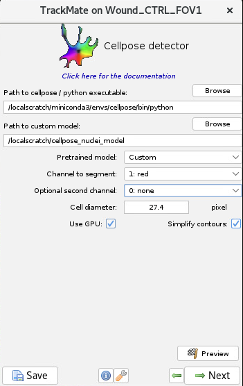

# 11 - Wound healing assay

---

# Data description

Data description here


# Pipeline overview

1. Denoise videos with [N2V](https://github.com/juglab/n2v) algorithm
2. Segment cells or nuclei with [Cellpose](https://www.cellpose.org/)
3. Track them with Fiji [Trackmate](https://imagej.net/plugins/trackmate/detectors/trackmate-cellpose)

## Step 1: Install python package manager
Install a package manager for python. We recommend [conda](https://conda.io/projects/conda/en/latest/user-guide/install/index.html) or [mamba](https://mamba.readthedocs.io/en/latest/).  
When installing either, make sure to select the installation folder that you have permissions for, i.e. your home folder.

## Step 2: Denoising with [N2V](https://github.com/juglab/n2v)
Denoising is an important step, which allows for better segmentation performance. Most pretrained segmentation models are trained with clean data, so noise in the data severely affects the resulting accuracy.  

You will likely need to re-train the denoising model for different experiments because differences in noise distribution will affect the performance.

If you do not have a GPU readily available, you can also try using an N2V notebook from [ZeroCostDL4Mic](https://github.com/HenriquesLab/ZeroCostDL4Mic) in Google Colab.  

### Installation:

1. Open terminal on your system (on Windows you can open PowerShell)

2. Create and activate the environment by running these commands:
    ```bash
    conda create -n denoising python=3.9 
    conda activate denoising
    ```
3. Install Tensorflow GPU following [this instruction](https://www.tensorflow.org/install/pip#linux_1). 

    N2V only supports TensorFlow 2. We recommend using version supported by your gpu. You can refer to [this table](https://www.tensorflow.org/install/source#tested_build_configurations) 
    to select the right version. We will use version **2.11.0** as an example.
    
    ```bash 
    pip install tensorflow[and-cuda]==2.11.0
    ```
    Check if the installation is correct and the package sees your GPU
    ```bash
    python -c "import tensorflow as tf; print(tf.config.list_physical_devices('GPU'))"
    ```
    You should see the output with your GPU model name.
    If you do not see any output, try installing a newer / older tensorflow version.

4. Install N2V and Jupyter
    ```bash 
    pip install n2v jupyter
    ```
        
5. Run jupyter service
    ```bash 
    jupyter notebook
    ```

6. In the opened browser page, load and follow these instructions to train your model  
[N2V_denoising.ipynb](resources/N2V_denoising.ipynb)
7. You can also try running a pre-trained model. For that, download and unzip the [pretrained model](resources/models/n2v_2D.zip), then go to the *7. Prediction* section in the Jupyter Notebook.


## Step 3: Segmentation with Cellpose

[Cellpose](https://github.com/MouseLand/cellpose) is a popular deep learning cell segmentation algorythm. 

### Installation

1. We recommend creating a separate environment.
```bash
conda create -n cellpose python=3.9
conda activate cellpose
```
    
2. Install pytorch. You should install version compatible with your GPU. You can find a package compatible with your cuda version [here](https://pytorch.org/get-started/previous-versions/). 
We will be installing version 1.12.0 and cuda version 11.3.
```bash 
conda install pytorch==1.12.0 torchvision==0.13.0 cudatoolkit=11.3 -c pytorch
```
    
3. Check if the installation is valid and GPU is available. You should see the output with your GPU name listed.
```bash
python -c "import torch; print([torch.cuda.get_device_properties(i) for i in range(torch.cuda.device_count())])"`
```
4. Install Cellpose
```bash 
pip install pyqt5 "cellpose[gui]"
```
5. Run Cellpose
```bash
cellpose
```
You should now see the cellpose window open. 

### Usage

You can **download** and **unzip** these pre-trained models for membrane and nuclei segmentation

[cellpose_membrane_model.zip](resources/models/cellpose_membrane_model.zip)

settings: cell diameter **46.09**, chan to segment: “2: green”, chan2: “1: red”

[cellpose_nuclei_model.zip](resources/models/cellpose_nuclei_model.zip)

settings: cell diameter **27.45**, chan to segment: “1: red”, chan2: “0: none”  

1) To add the pretrained model into the interface you should click X 
2) Select the added model in the `custom models` section
3) Click `predict` and check the model performance
<br>

### How to train your own model

You can watch a video tutorial on how to use Cellpose here - [https://www.cellpose.org/](https://www.cellpose.org/) 

Here are the steps that we followed:

1. Manually prepare several (5-10) individual **denoised time points** from the output of **Step 1**. The model can not work with the time series, only individual images. The more diverse the samples are - the better.

2. Select the channels you want to segment (If the channels in the data differ from the ones below - use the ones in your data!)

Example channels for nuclei segmentation


Example channels for cell segmentation (with nuclei channel as an additional channel)


3. Click on “calibrate” button. The algorythm will try to determine the average object size automatically and update `Cell diameter`. Check the circle that appeared in the left-bottom corner, it should be approximately the size of the objects you want to segment. 
4. Try using different pretrained models in the interface. The best model for the nuclei in this data generally are `cyto`, `nuclei`, `CP`, or `CPx`, for membranes - `cyto`
. To load the pre-trained model - click `Models` > `Add custom model`

4. After finding the best model, look through the errors in the predictions and fix a few of them. `Click Help` > `Help with GUI` for help with labeling controls.

5. Train a new model on the fixed data. Click `Models` > `Train new model`. Choose the best model from step 3 as an initial model. You cannot select a custom model as an initial model.

6. After training, you’ll see your new model in the `custom models` section. It will also be saved in the folder with your data. `Cell diameter` will also be updated with what the model learned from the data - **take note of the new cell diameter**.

7. You can continue iterating: predict with the model - fix a couple of mistakes - train a new model - fix mistakes - train a new model …


## Step 4: Tracking with Trackmate-Cellpose in Fiji

To use the resulting model on a time series and track the segmentations, install the [TrackMate-Cellpose](https://imagej.net/plugins/trackmate/detectors/trackmate-cellpose)
 integration in Fiji.

### Usage
1. Open a **denoised** time-series.

2. Add the path to the Cellpose environment that you installed in **Step 2**. To find that path, you can activate the environment where you installed Cellpose and run the terminal command `which python`. 
3. Select the path to your model and it's settings. Enter the channels you want to segment and the approximate diameter of your objects. 


4. Press `preview` to run prediction on one timepoint and check the result. The nuclei on the image are now highlighted. 


5. Press “next” to run prediction on all time points (it can take a while). Do not filter the resulting spots.

6. For tracking we used the LAP tracker with the following settings:

    

      And used these visualization settings:
    
    

    To get this result:
    
    

7. To improve the results play around with different distance settings, feature penalties, and track filtering.
